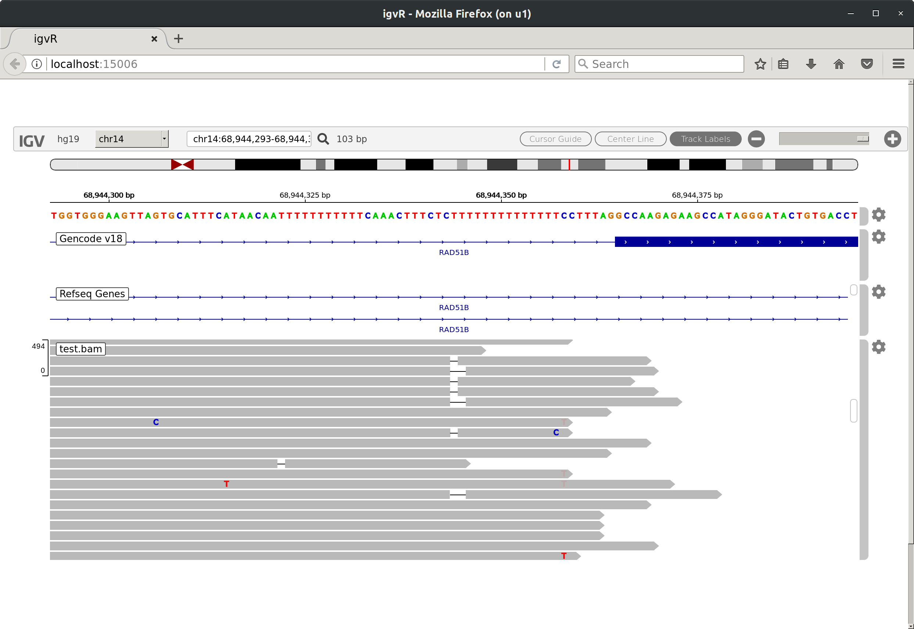
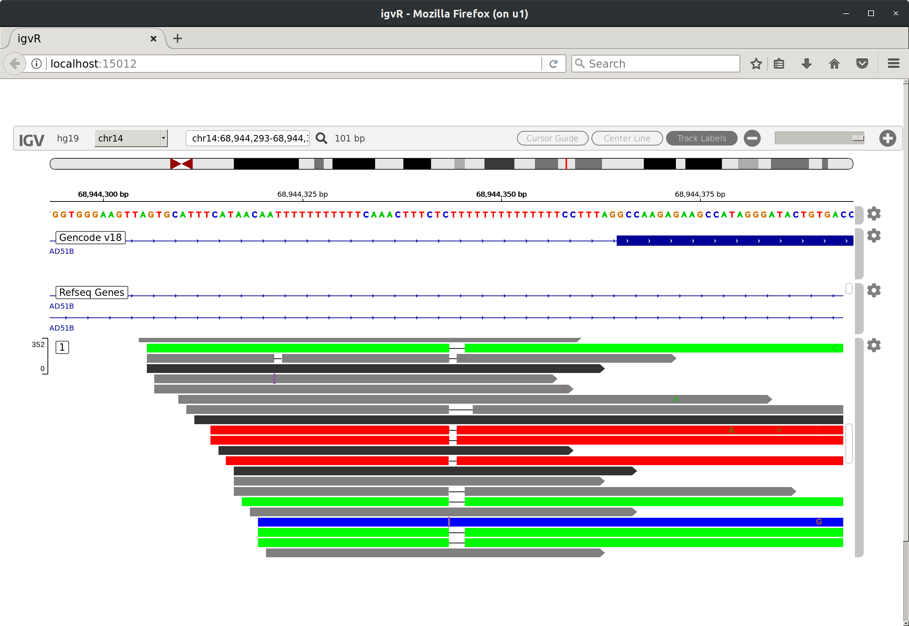

```{r, include = FALSE}
knitr::opts_chunk$set(
  collapse = TRUE,
  comment = "#>"
)
```

```{r}
suppressPackageStartupMessages(
    library(VarReviewer)
)
library(BSgenome.Hsapiens.1000genomes.hs37d5)
```

# View BAM for a variant
```{r}
bam <- system.file("extdata", "test.bam", package="VarReviewer")
vcf <- system.file("extdata", "test.vcf", package="VarReviewer")
v1 <- readVcf(vcf)
```

```{r, eval=FALSE}
viewAligns(rowRanges(v1), bam)
```

{width=600px}

# Re-align BAM and VCF to SE

## Re-align counts

To realign reads locally to reference and alternative sequences for
given variant.

```{r}
rse <- reAlign(rowRanges(v1), bam)
rse
assays(rse)$ADP[1,1][[1]]
```

## View alignments

A "YC" tag will be added to the outputs to label reads with different
alignments using different colors.

```{r, eval=FALSE}
aln <- assays(rse)$Align[1,1][[1]]
viewAligns(aligns = aln, bamParam=list(tag="YC"))
```

{width=600px}
